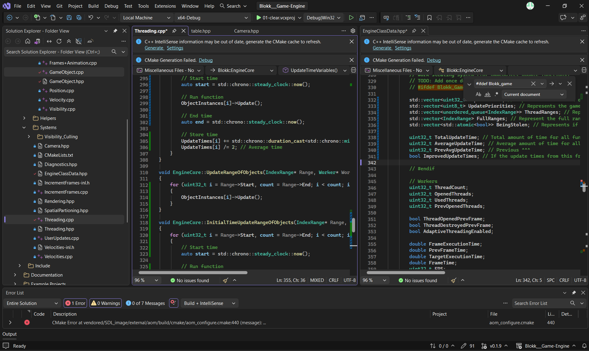

# AI Use

The AI models used were chatGPT and GitHub copilot. 

They were used in this project for:
* **Documentation** — Creating documentation for code files
* **Error checking** — Mostly deciphering long error outputs, and checking for errors
* **Task checking** — Checking what's completed, what needs to be done and outputting a TODO list (it gets hard to track)
* **Code tweaks** — Fixing syntax, changing names, text substitutions (where changing the names of functions takes a long time because there are a lot) 
* **Research** — Mostly concepts, ideas, comparing, etc
* Troubleshooting — Helping narrow down problems when something isn't behaving as expected (rather than taking hours manually searching) 
* **Architecture discussion** — Discussing possible system designs, data structures, APIs, and implementation approaches (there were a lot)

AI was NOT used for:
* **Major code generation** — Created by a human, designed by one too!
* **Logo generation** — Designed and created by a human, using Inkscape (an SVG editor)
* **Project direction** — Features, goals, priorities, and the overall direction of the project were decided by a human!

Here's a 2-hour timelapse (as proof that this wasn't vibe coded) of me coding the project:

